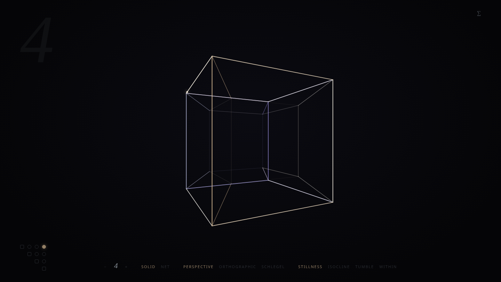

# hypercube

A contemplative, zero-dependency visualization of the n-dimensional
hypercube: its rotations, its symmetries, its projections — from the square
to the 6-cube.



No framework, no build step, no npm packages: vanilla ES modules and a
single Canvas 2D wireframe. The mathematics lives in a pure, fully tested
core; the chrome fades away after three seconds and leaves you with the
object.

## Run

```sh
npm start   # python -m http.server; ES modules don't load over file://
```

Then open <http://localhost:8000>.

## Controls

| Control                                                | Effect                                                                      |
| ------------------------------------------------------ | --------------------------------------------------------------------------- |
| `− / +` or keys `2`–`6`                                | dimension                                                                   |
| `solid · net` or `u`                                   | the object, or its unfolding (the Dalí cross for n = 4)                     |
| `perspective · orthographic · schlegel` or `p / o / s` | projection (Schlegel adds translucent face veils)                           |
| `stillness · isocline · tumble · within`               | motion presets                                                              |
| grid, off-diagonal dots (bottom left)                  | toggle rotation in a C(n,2) plane; double-click: exact quarter-turn         |
| grid, diagonal squares                                 | mirror an axis — one reflection of B_n, collapsing through the (n−1)-shadow |
| drag                                                   | rotate the screen-facing planes                                             |
| `Shift` + drag                                         | rotate against the highest axis (touch the 4th dimension)                   |
| wheel, or pinch                                        | dolly the final perspective                                                 |
| `Σ` (top right)                                        | element counts, symmetry order, and the Gray-code comet (`g`)               |
| `Space`                                                | pause                                                                       |

A pose is shareable via URL:
`?n=5&view=net&projection=schlegel&preset=within&gray=1`.

## Project structure

```
index.html            single page, no build
styles/main.css       dark theme tokens, idle-fading chrome
src/core/             pure math — no DOM, the only code under test
  hypercube.js        vertices as bit strings, edges as bit flips
  net.js              the 2n facets unfolded (Dalí cross), same pipeline
  combinatorics.js    counts, Gray code, rotation planes, |B_n| = 2^n·n!
  matrix.js           n×n helpers, Gram–Schmidt
  rotation.js         C(n,2) plane rotations on an accumulated Q ∈ SO(n)
  projection.js       perspective / orthographic / Schlegel cascade to 2D
src/render/           Canvas 2D wireframe: depth fade, w-temperature, comet
src/ui/               controls, structure panel, motion presets
test/                 node --test suite for the core
tools/verify.mjs      headless end-to-end checks (npm run verify)
docs/mathematics.md   the notes behind all of the above
```

## Test

```sh
npm test         # node --test over the pure core, zero dependencies
npm run verify   # end-to-end checks in headless Chromium (set $CHROME to override)
```

CI runs `npm test` on every push.

## Design notes

Three choices carry the tone. The interface dissolves after three seconds
of stillness, so the object is alone on the screen. The fourth dimension is
not labeled but _felt_: depth in 3-space sets presence (alpha and line
weight), while the extra coordinate shifts temperature from violet (far) to
amber (near). And the one flourish — a comet walking the binary-reflected
Gray code — is a theorem you can watch: a Hamiltonian cycle on Q_n, one bit
at a time.

See [docs/mathematics.md](docs/mathematics.md) for the constructions.
